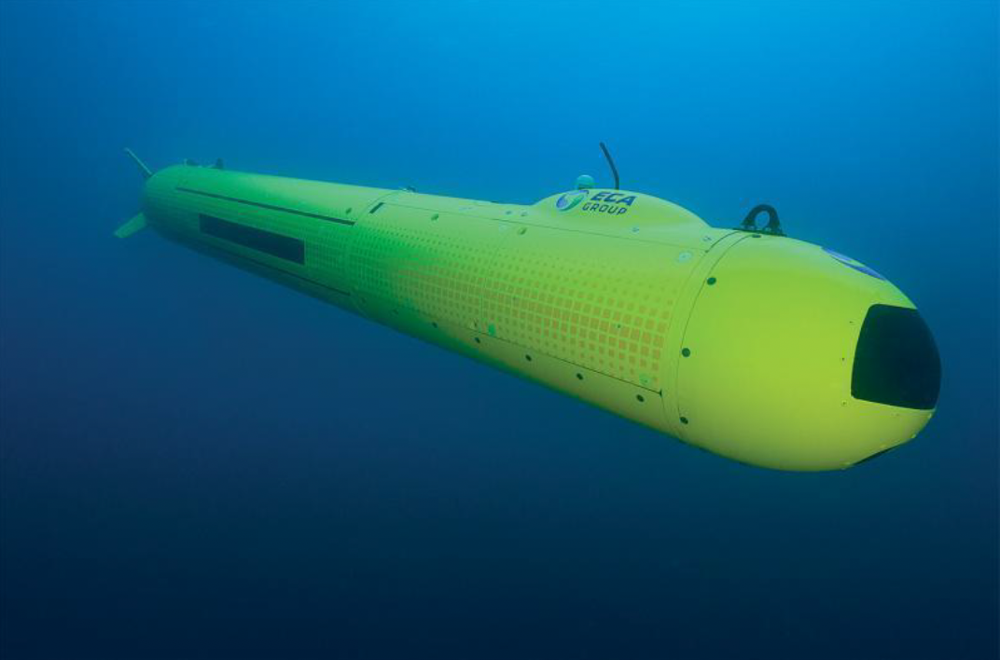
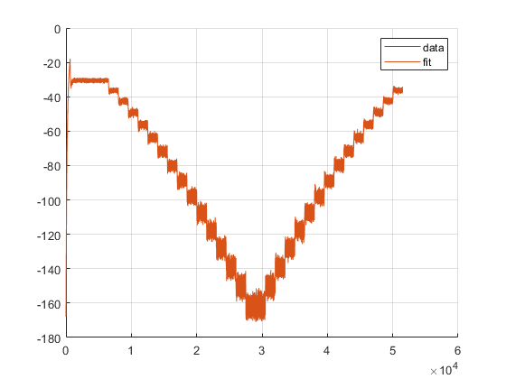
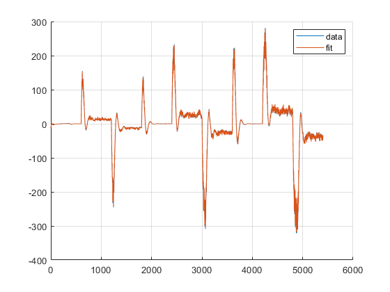
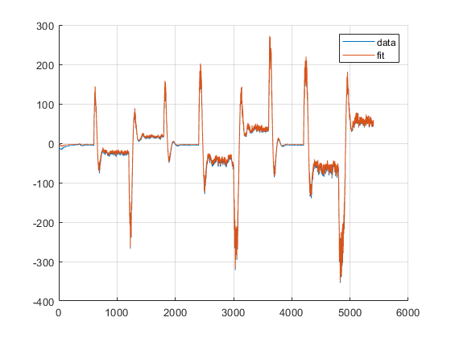
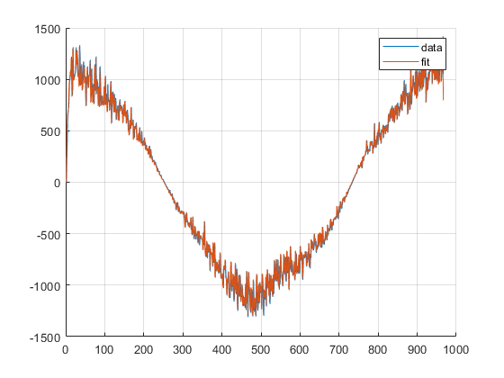
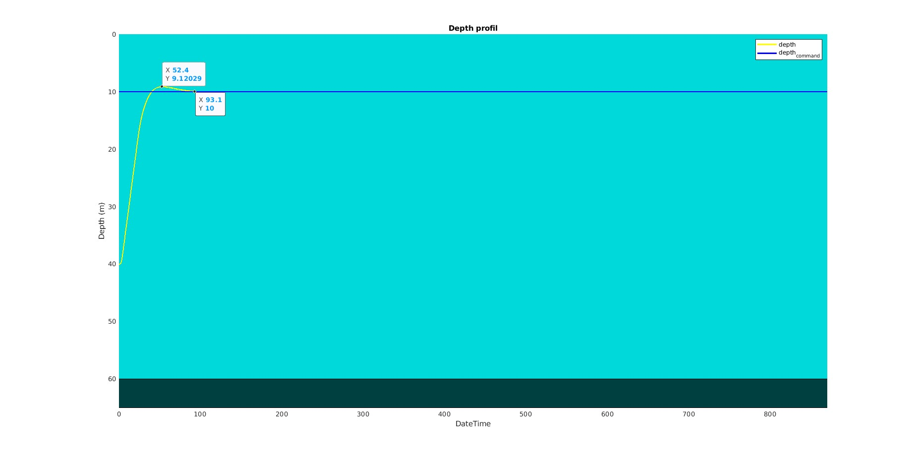
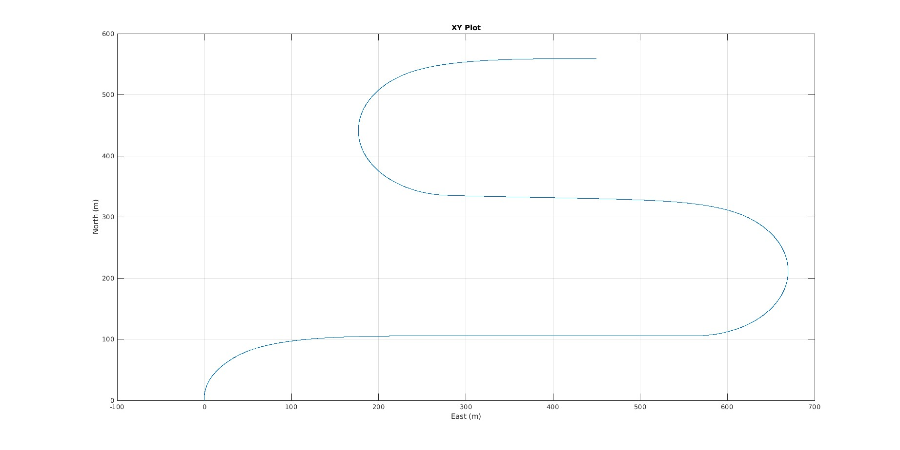
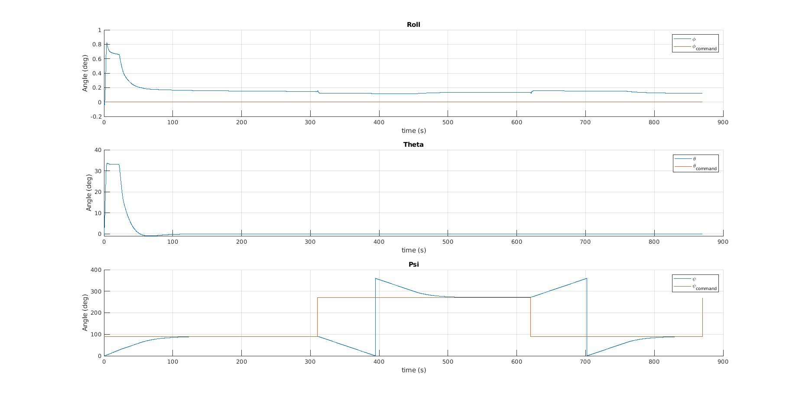
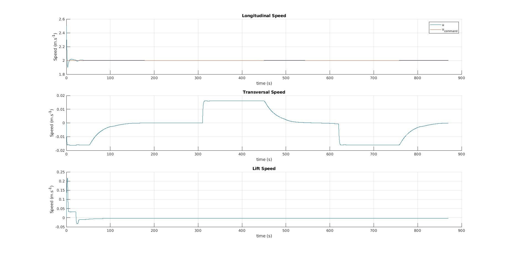

# AUV Control Optimisation using LQR


The objective of theis project is to improve the vertical stability of the AUV, we propose using a Linear Quadratic Regulator(LQR) controller instead of the existing Proportional-Integral-Derivative(PID) controller. Our specific objectives to implement the LQR controller are:

1.  Identify the missing hydrodynamic parameters using the provided data.
2. Linearize the simplified nonlinear AUV model.
3. Select and implement a motion control system.
4. Refine the LQR’s tuning for vertical commands.

Group Members:

* [Abhimanyu Bhowmik](https://github.com/abhimanyubhowmik)
* [Madhushree Sannigrahi](https://github.com/Madhushree2000)
* [Chashnikov Sergei](https://www.linkedin.com/in/schashni/)
* [Akshat Sinha](https://www.linkedin.com/in/akshatsinha14/)

<div align="center">

<p>Autonomous Underwater Vehicle (A-18)</p>
</div>


## How to Use

Prerequisites:

* ```
  Matlab R2021b +
  Control System Toolbox
  ```
* Cloning the Project Repository : ```git@github.com:abhimanyubhowmik/Control_Optimization_AUV.git```
* Reference Documents:
  ```
  Doc/AUV Model.pdf
  Doc/Guide to pratical work.pdf
  Doc/Report.pdf
  ```
* For detailed documentation of the code run on browser:
  ``` Doc/Code```

* For simulation run :```ECA_ControlCommand/Example_RunSimulation```.


## System Identification

All the parameters are provided except the damping parameters in the horizontal and vertical plane, as $K_{sh}$, $CY_{uv}$, $CY_{ur}$, $CN_{uv}$, $CN_{ur}$, $CZ_{uw}$, $CZ_{uq}$, $CM_{uw}$, $CM_{uq}$.

Here,

- $CY_{uv}$: Force damping coefficient $F_Y$ by the product of $u\cdot v$.
- $CY_{ur}$: Force damping coefficient $F_Y$ by the product of $u\cdot r$.
- $CN_{uv}$: Damping coefficient of the moment $M_Z$ by the product of $u\cdot v$.
- $CN_{ur}$: Damping coefficient of the moment $M_Z$ by the product of $u\cdot r$.
- $CZ_{uw}$: Force damping coefficient $F_Z$ by the product of $u\cdot w$.
- $CZ_{uq}$: Force damping coefficient $F_Z$ by the product of $u\cdot q$.
- $CM_{uw}$: Damping coefficient of the moment $M_Y$ by the product of $u\cdot w$.
- $CM_{uq}$: Damping coefficient of the moment $M_Y$ by the product of $u\cdot q$.

We have estimated (Detailed in `Doc/Report.pdf`) the parameters and compared them with measured values given below

<div align="center">
<table>
  <tr>
    <td width="50%"> <br>(a) </td>
    <td width="50%"> <br>(b) </td>
  </tr>
  <tr>
    <td width="50%"> <br>(c) </td>
    <td width="50%"> <br>(d) </td>
  </tr>
</table>
</div>

Comparison between the measured and the estimated (a) $K_{sh}$ ,(b) $CZ_{uw}, CZ_{uq}$, (C) $CM_{uw}, CM_{uq}$, (d) $CY_{uv}, CY_{ur}$

## Linearization

We have linearized the system as: $\dot{X} = AX + BU$ where,

$$X = 
\begin{bmatrix}
    q\\
    w\\
    z\\
    \theta\\
    \int{z}
\end{bmatrix}$$


<center>

$A = $
|                                        |                                        |                                        |                                              |                                                   |
|----------------------------------------|----------------------------------------|----------------------------------------|----------------------------------------------|---------------------------------------------------|
| $\frac{\partial{\dot{q}}}{\partial{q}}$ | $\frac{\partial{\dot{q}}}{\partial{w}}$ | $\frac{\partial{\dot{q}}}{\partial{z}}$ | $\frac{\partial{\dot{q}}}{\partial{\theta}}$ | $\frac{\partial{\dot{q}}}{\partial{\int{z}}}$ |
| $\frac{\partial{\dot{w}}}{\partial{q}}$ | $\frac{\partial{\dot{w}}}{\partial{w}}$ | $\frac{\partial{\dot{w}}}{\partial{z}}$ | $\frac{\partial{\dot{w}}}{\partial{\theta}}$ | $\frac{\partial{\dot{w}}}{\partial{\int{z}}}$ |
| $\frac{\partial{\dot{z}}}{\partial{q}}$ | $\frac{\partial{\dot{z}}}{\partial{w}}$ | $\frac{\partial{\dot{z}}}{\partial{z}}$ | $\frac{\partial{\dot{z}}}{\partial{\theta}}$ | $\frac{\partial{\dot{z}}}{\partial{\int{z}}}$ |
| $\frac{\partial{\dot{\theta}}}{\partial{q}}$ | $\frac{\partial{\dot{\theta}}}{\partial{w}}$ | $\frac{\partial{\dot{\theta}}}{\partial{z}}$ | $\frac{\partial{\dot{\theta}}}{\partial{\theta}}$ | $\frac{\partial{\dot{\theta}}}{\partial{\int{z}}}$ |
| $\frac{\partial{\int{\dot{z}}}}{\partial{q}}$ | $\frac{\partial{\int{\dot{z}}}}{\partial{w}}$ | $\frac{\partial{\int{\dot{z}}}}{\partial{z}}$ | $\frac{\partial{\int{\dot{z}}}}{\partial{\theta}}$ | $\frac{\partial{\int{\dot{z}}}}{\partial{\int{z}}}$ |

</center>


$$B = 
\begin{bmatrix}
    \frac{\partial q}{\partial BAR}\\
    \\
    \frac{\partial w}{\partial BAR}\\
    \\
    \frac{\partial z}{\partial BAR}\\
    \\
    \frac{\partial \theta}{\partial BAR}\\
    \\
    \frac{\partial \int{z}}{\partial BAR}\\
\end{bmatrix}$$

For more details refer to `Doc/Report.pdf`.

## Simulation

After running the simulation with all the parameters, the following results were plotted, describing the behaviour of the system modelled.

### Depth Profile:

The graph illustrates the AUV's vertical trajectory during the ascent from a depth of 40 meters to 10 meters. As evident from the graph, it took approximately 50 seconds for the AUV to reach the 40-meter depth, exhibiting a slight overshoot. The AUV then stabilized within the desired depth range within approximately 100 seconds.

<div align="center">

<p>Depth Profile</p>
</div>

### XY Plot:

This shows the trajectory of the AUV as viewed from the ocean surface.

<div align="center">

<p>Matlab Simulator</p>
</div>

### Euler angles:

In the vertical section, the roll $\phi$ and yaw $\psi$ angles are negligible, while the pitch angle $θ$ plays a significant role. The roll angle increases quite a lot in the beginning but quickly reduces to $\leq 0.2$ at around 100 seconds. The thrusters are adjusted to maintain a positive pitch angle, causing the AUV to ascend initially. As the AUV approaches the desired depth of 10 meters after about 100 seconds, the pitch angle $θ$ is reduced, eventually reaching zero at around 100 seconds when the desired depth is reached.

<div align="center">

<p>Euler angles</p>
</div>

### Linear Speed:

The AUV's longitudinal speed remained relatively steady throughout the ascent, maintaining a constant propulsion speed of 2ms−1. This forward motion, combined with the controlled inclination angle θ, facilitated the AUV's ascent. The lift speed, while small in magnitude, provided a subtle but significant contribution to the AUV's vertical control. This control was effectively adjusted until the desired depth of 10m was achieved, which occurred around 380 seconds into the ascent. Notably, the lift speed remained stable without any oscillations, a result attributed to the low value of the parameter "w".


<div align="center">

<p>Linear Speed</p>
</div>


For further details refer to: `Doc/Report.pdf`.

